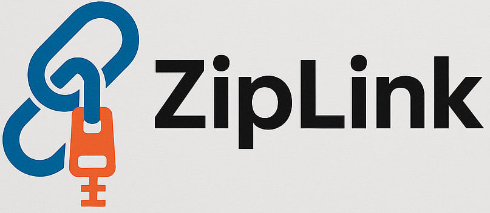

<p align="center">
  
</p>

# Ziplink 🔗

**Ziplink** is a URL shortening service that allows users to generate compact, shareable links.  
Built for speed, reliability, and ease of use.

---

## 🚀 Features

🔗 URL Shortening – Instantly convert long URLs into concise, shareable links.

🧠 URL Analytics – Gain insights into link performance with detailed click tracking and usage stats.

🛡️ Validation & Security – Protect users with robust URL validation and safeguards against malicious links.

⚡ High Performance – Lightweight and optimized backend built for speed and scalability.

📊 Link Analysis Tools – Analyze shortened URLs for traffic patterns, referrers, and device types.

✏️ Custom Short Links – Create branded or personalized short URLs to enhance user trust and recognition.

---

## 🛠️ Tech Stack

- Java / Spring Boot
- PostgreSQL / Hibernate
- RESTful APIs

---

## 📦 Getting Started

### Prerequisites

- Java 21+
- Maven
- PostgreSQL


## 📫 API Testing with Postman

You can explore and test all available endpoints using the Postman collection provided.

🔗 [Download Postman Collection](postman/Ziplink.postman_collection.json)

To use it:

1. Open Postman
2. Click `Import`
3. Upload the `Ziplink.postman_collection.json` file
4. Start testing the API!

---

## 🧩 Software Architecture – C4 Model

The **Ziplink** system architecture is described using the [C4 model](https://c4model.com), which provides a clear and structured way to visualize software systems across multiple levels of detail.

---

### 1️⃣ Level 1: System Context Diagram

**Ziplink** is a URL shortening platform used by:

- 📱 **End Users** – To generate, manage, and share shortened URLs.  
- 🛠️ **Administrators** – To monitor usage and control malicious content.

It interacts with:

- 🌐 **Web Clients** – Through RESTful API calls.

---

### 2️⃣ Level 2: Container Diagram

The system is composed of:

- 🧠 **Ziplink API (Spring Boot)**  
  Handles business logic, REST endpoints, validation, and analytics.

- 🗃️ **PostgreSQL Database**  
  Stores original URLs, shortened codes, click analytics, and custom URLs.

---

### 3️⃣ Level 3: Component Diagram ✅ (Included in PDF)

Within the **Ziplink API**, the following components are defined:

- **URLController**  
  Exposes API endpoints for shortening and redirecting URLs.

- **URLService**  
  Contains logic for generating short codes, resolving links, and handling custom aliases.

- **URLRepository**  
  Interfaces with the database to persist and retrieve data.

- **AnalyticsService**
  Logs click data for analysis

- **ValidationService**  
  Ensures submitted URLs are valid and secure.

---

### 📄 Architecture Diagram

You can view the full **Component Diagram** in the attached architecture document:

📎 [Download ZIPLINK_Document.pdf](document/ZIPLINK_Document.pdf)

---

### Installation

    ```bash

       git clone https://github.com/Mehdi-Sokhanvar/Ziplink.git
        cd Ziplink
        mvn clean install

 


## 🤝 Collaboration & Contribution

We welcome collaboration from developers, designers, and open-source enthusiasts! Whether you're fixing bugs, suggesting improvements, or adding new features, your contributions are highly appreciated.

### 🧑‍💻 How to Contribute

1. **Fork** this repository.
2. Create a new **branch** for your feature or bug fix:
   ```bash
   git checkout -b feature/your-feature-name


## ⭐ Support This Project

If you find **Ziplink** useful or interesting, please consider giving it a ⭐ on GitHub!  
It helps others discover the project and motivates us to keep improving it.

👉 [Click here to star the repository](https://github.com/Mehdi-Sokhanvar/Ziplink/stargazers)

## 📄 License

This project is licensed under the [MIT License](LICENSE).

You are free to use, modify, and distribute this software with proper attribution.
